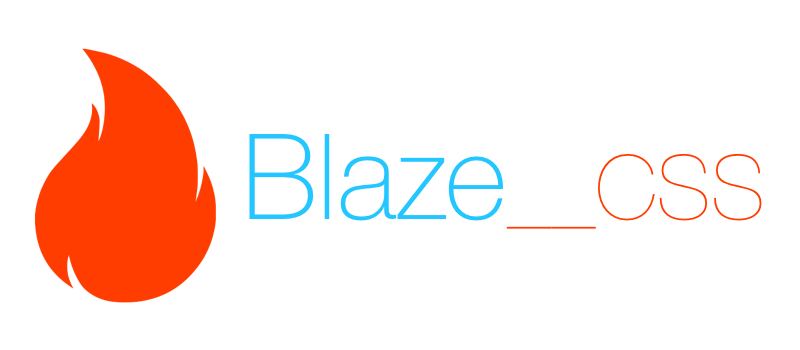

# Blaze CSS



<a href="https://www.npmjs.com/package/blaze"></a>
<a href="https://www.npmjs.com/package/blaze"></a>
<a href="https://github.com/BlazeCSS/blaze/blob/master/LICENSE"></a>

Open Source Modular CSS Framework. Blaze is designed to give you structure and a good starting point for your website.

## CDN

Blaze is available from JSDelivr:

```html
<link rel="stylesheet" href="https://cdn.jsdelivr.net/blazecss/latest/blaze.min.css">
<link rel="stylesheet" href="https://cdn.jsdelivr.net/blazecss/latest/base.css">
<link rel="stylesheet" href="https://cdn.jsdelivr.net/blazecss/latest/grid.css">
. . .
```

## Install via NPM

```bash
npm install blaze
```

## Install via Bower

```bash
bower install blazecss
```

## Small size

When compressed and gzipped the whole framework is **<a href="https://raw.githubusercontent.com/BlazeCSS/blaze/master/dist/blaze.min.css">only 6.8kb</a>**.

## Modular

You can use any part of Blaze independently, just want to use the Grid? or only need styles for some Toggles? Each part is available as separate CSS files. 

### Suggestions

If you'd like to suggest new styles or enhancements please <a href="https://github.com/BlazeCSS/blaze/issues">raise an issue</a>.

### Contributing

First of all, Pull Requests, suggestions or comments about Blaze are all welcome and valued. To start contributing follow these steps:

#### Step 1

**Fork the repo!**

#### Step 2

Write some code...

#### Step 3

**Submit your Pull Request to our DEV branch** so that we can review the code before merging into master.

#### Sit back

At some point your changes will get merged in and we'll publish a new version! Yay!

#### Code Conduct
We're all friends! This project adheres to the [Open Code of Conduct][code-of-conduct]. By participating, you are expected to honor this code.
[code-of-conduct]: http://todogroup.org/opencodeofconduct/#BlazeCSS/gregory.pratt@me.com

**<a class="link" href="https://www.browserstack.com/">Thanks to BrowserStack</a> for providing a free plan for testing Blaze.**