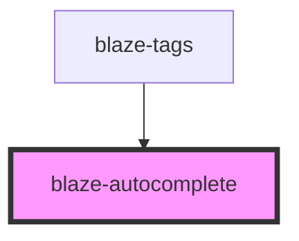

# blaze-autocomplete

<!-- Auto Generated Below -->

## Properties

| Property      | Attribute     | Description | Type     | Default     |
| ------------- | ------------- | ----------- | -------- | ----------- |
| `placeholder` | `placeholder` |             | `string` | `undefined` |

## Events

| Event      | Description | Type               |
| ---------- | ----------- | ------------------ |
| `filter`   |             | `CustomEvent<any>` |
| `selected` |             | `CustomEvent<any>` |

## Methods

### `reset() => Promise<void>`

#### Returns

Type: `Promise<void>`

### `setItems(items: Array<IAutoCompleteItem>) => Promise<void>`

#### Returns

Type: `Promise<void>`

## Dependencies

### Used by

 - [blaze-tags](../tags)

### Graph

----------------------------------------------

*Built with [StencilJS](https://stenciljs.com/)*
