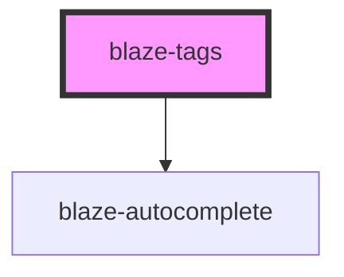

# blaze-toggle

<!-- Auto Generated Below -->

## Properties

| Property       | Attribute      | Description | Type      | Default     |
| -------------- | -------------- | ----------- | --------- | ----------- |
| `autocomplete` | `autocomplete` |             | `boolean` | `undefined` |
| `options`      | `options`      |             | `string`  | `undefined` |
| `placeholder`  | `placeholder`  |             | `string`  | `undefined` |

## Events

| Event    | Description | Type               |
| -------- | ----------- | ------------------ |
| `add`    |             | `CustomEvent<any>` |
| `filter` |             | `CustomEvent<any>` |

## Methods

### `setOptions(options?: Array<IOption>) => Promise<any>`

#### Returns

Type: `Promise<any>`

## Dependencies

### Depends on

- [blaze-autocomplete](../autocomplete)

### Graph

----------------------------------------------

*Built with [StencilJS](https://stenciljs.com/)*
